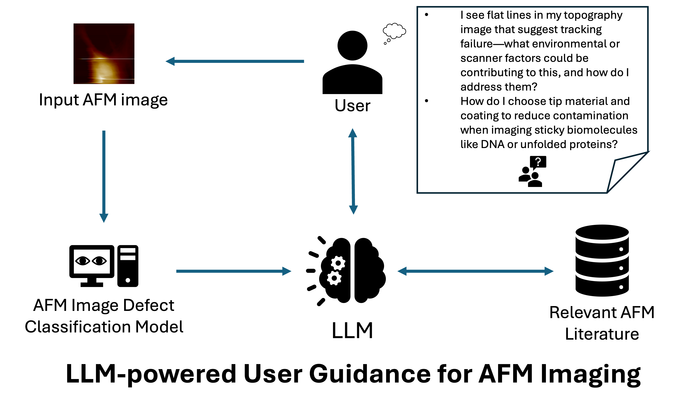

# AI-AFM-Agent for Defect Detection in AFM Images

# TODO

- [x] Generate 50 detailed questions related to AFM image defects focusing on multiple sample types, scanning parameters, and defect types.
- [x] Generate answers using GPT-4o, Claude-3.5-sonnet.
- [x] Generate answers using Gemini model
- [ ] Generate answers using reasoning models.
- [ ] Get evaluateions from AFM experts for the answers.
- [ ] Work on UI for AFM agent
