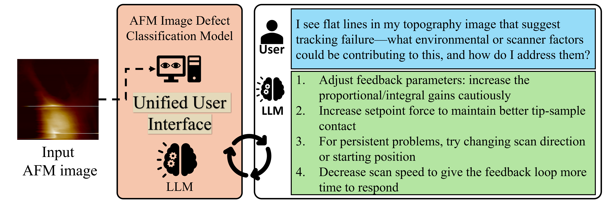

# AI-AFM-Agent for Defect Detection in AFM Images

# TODO

- [ ] Evaluate RAG vs non-RAG responses
  - [ ] Find evaluation metrics for RAG vs non-RAG responses
- [ ] Find the answer: Is Reasoning model with document better without fine-tuning LLM? (Clarify with Dr.Soumik)
- [ ] Work on UI for AFM agent
